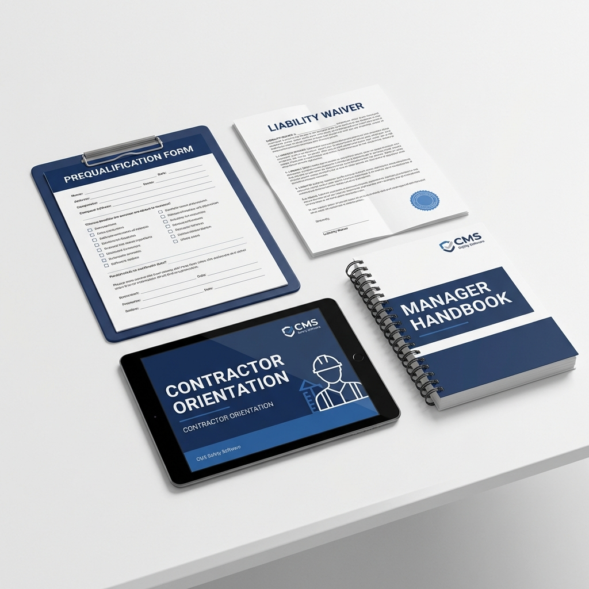

# Contractor Management System

## 🏷️ Price: $97.00
*(One-time purchase. Lifetime updates.)*

---

## 🛡️ Shield Your Business from Third-Party Liability
Hiring contractors is necessary, but it introduces massive risk. If a contractor gets hurt on your site, or causes an accident, YOU can be held liable. The "handshake deal" is dead. You need a rigorous, documented system to vet, orient, and manage outside labor.

**The Contractor Management System** is a "defense-in-depth" strategy for your business. It forces every contractor to prove they are safe *before* they step foot on your property, and legally binds them to your safety rules.

---

## 📦 What's Included
1.  **Prequalification Questionnaire (4 Pages)**
    *   *The "Gatekeeper".* A rigorous scoring system to grade contractors on their safety history (EMR), insurance coverage, and training programs. Includes a "Stop Light" (Green/Yellow/Red) approval guide.
2.  **Liability Waiver & Hold Harmless Agreement (2 Pages)**
    *   *The "Shield".* A lawyer-drafted-style legal document where the contractor explicitly assumes risk and indemnifies your company. Essential for protecting your assets.
3.  **Contractor Orientation Deck (12 Slides)**
    *   *The "Welcome".* A professional PowerPoint-ready HTML deck covering Site Rules, PPE, Emergency Response, and Code of Conduct.
4.  **Manager's Implementation Handbook (3 Pages)**
    *   *The "Playbook".* A step-by-step guide for your facility managers on how to roll this system out without stalling operations.

---

## 🚀 The Problem This Solves
*   **Problem:** Contractors ignoring your safety rules because "they don't work for you."
    *   **Solution:** The *Orientation Deck* makes your rules a condition of entry.
*   **Problem:** Being sued for a contractor's negligence.
    *   **Solution:** The *Liability Waiver* shifts the legal burden back to them.
*   **Problem:** Hiring "Low Bid / High Risk" outfits.
    *   **Solution:** The *Prequal Form* filters out the dangerous operators before the contract is signed.

---

### "Don't hope they work safely. Mandate it."
*Instant Digital Download. HTML/PDF Ready.*
