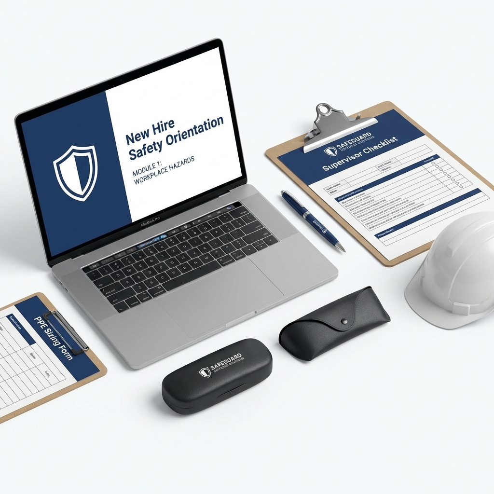

# New Hire Safety Orientation

## 🏷️ Price: $97.00
*(One-time purchase. Lifetime updates.)*

---

## 🎓 Day 1 Compliance in a Box
The first 4 hours of an employee's tenure set the tone for their entire career. A sloppy, rushed orientation tells them "Safety doesn't matter here." A professional, structured orientation tells them "We are professionals, and we demand excellence."

**The New Hire Safety Orientation Kit** transforms your onboarding from a "checklist item" into a culture-building event. It ensures every single new hire hears the same message, understands the Cardinal Rules, and is physically validated as competent by their supervisor.

---

## 📦 What's Included
1.  **Safety Orientation Slide Deck (12 Slides)**
    *   *The "Curriculum".* A comprehensive presentation covering Safety Culture, PPE, Bloodborne Pathogens, Hazard Communication, and Emergency Procedures.
2.  **Supervisor Onboarding Passport (2 Pages)**
    *   *The "Validation".* Not just a checklist. It's a structured 1-Week review where the supervisor must observe behaviors and "Sign Off" that the employee is ready to work solo.
3.  **PPE Sizing & Care Form (2 Pages)**
    *   *The "Gear".* Ensures employees get gear that actually fits (increasing compliance) and teaches them how to inspect and maintain it.
4.  **Safety Commitment Pledge**
    *   *The "Oath".* A psychological contract where the employee signs their name to the safety rules.

---

## 🚀 The Problem This Solves
*   **Problem:** "I didn't know I had to wear that."
    *   **Solution:** The *Orientation Deck* removes all ambiguity about rules.
*   **Problem:** Supervisors "pencil whipping" training paperwork.
    *   **Solution:** The *Passport* requires specific behavioral observations over a week.
*   **Problem:** New hires getting hurt in their first month (The "Green Hat" effect).
    *   **Solution:** Enhanced training and defined "release to work" criteria reduce early-tenure incidents.

---

### "First impressions last forever. Make it safe."
*Instant Digital Download. HTML/PDF Ready.*
