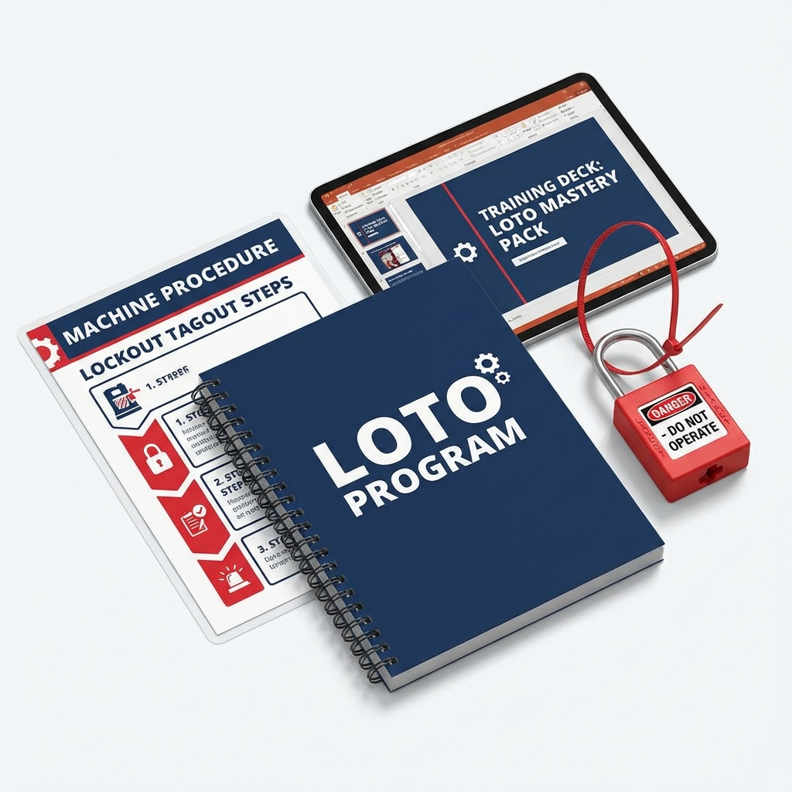

# LOTO Mastery Pack (Zero Energy)

## 🏷️ Price: $127.00
*(One-time purchase. Lifetime updates.)*

---

## 🔒 Defeat OSHA's #1 Violation
Lockout/Tagout (Control of Hazardous Energy) is consistently one of the most cited OSHA violations and the cause of gruesome, fatal accidents. "I thought it was off" is not a defense.

**The LOTO Mastery Pack** moves you beyond simple compliance into a robust "Zero Energy" state. It provides the written programs, specific procedures, and auditing tools required to ensure that when a machine is off, it *stays* off.

---

## 📦 What's Included
1.  **Written LOTO Program Manual (5 Pages)**
    *   *The "Law".* A fully expanded policy document covering Group Lockout, Shift Changes, Contractor LOTO, and Abandoned Locks. OSHA 1910.147 compliant.
2.  **Machine-Specific Procedure Template (2 Pages)**
    *   *The "Map".* A visual template for creating the required "Lockout Placards" for each machine. Includes placeholders for energy source photos and isolation points.
3.  **Annual Periodic Inspection Form (2 Pages)**
    *   *The "Audit".* A mandatory tool to audit both the procedure AND the employee. Features a "Corrective Action" tracking section.
4.  **LOTO Training Slide Deck (13 Slides)**
    *   *The "Classroom".* Teaches the Fatal 6 steps, the difference between Affected and Authorized employees, and the physics of stored energy.

---

## 🚀 The Problem This Solves
*   **Problem:** Relying on "Tagout" instead of physical locks.
    *   **Solution:** The *Program* mandates locks and strictly limits tag use.
*   **Problem:** "We don't have procedures for specific machines." (Instant fine).
    *   **Solution:** The *Procedure Template* makes it easy to map every machine in your shop.
*   **Problem:** Complacency creeping in over time.
    *   **Solution:** The *Annual Inspection Form* forces a yearly reset on habits.

---

### "Energy doesn't forgive. Lock it out."
*Instant Digital Download. HTML/PDF Ready.*
