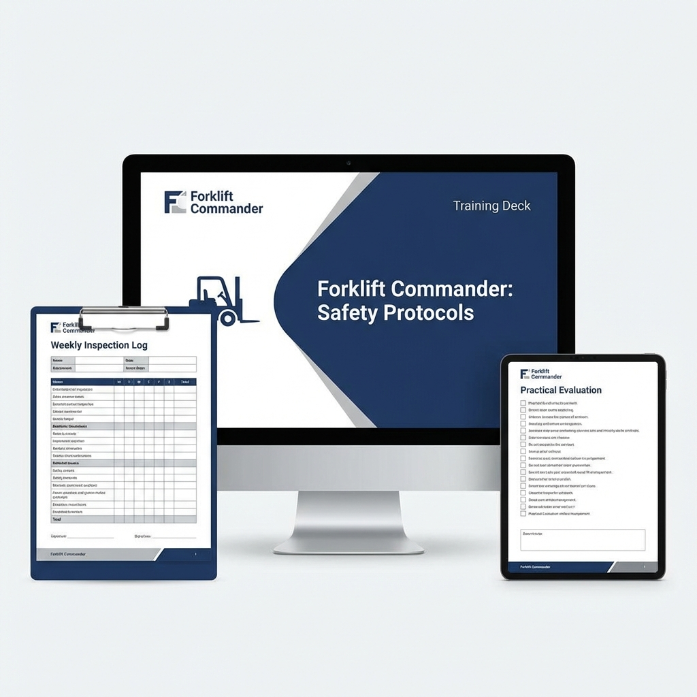

# Forklift Commander Training Kit

## 🏷️ Price: $127.00
*(One-time purchase. Lifetime updates.)*

---

## 🚜 Stop the #2 Killer in Industry
Forklifts are heavy, unstable, and dangerous. They are the "sharks" of the warehouse floor. Most accidents happen not because the driver didn't know how to drive, but because they lacked *discipline*.

**The Forklift Commander Kit** focuses on the psychology of the operator. It emphasizes the "Stability Triangle," pedestrian rights, and the absolute necessity of the daily inspection. It turns drivers into Operators.

---

## 📦 What's Included
1.  **Forklift Commander Training Deck (15 Slides)**
    *   *The "Theory".* Expanded deck covering Physics (Stability Triangle), Load Centers, Refueling/Recharging, and Tip-Over Survival.
2.  **Weekly Inspection Log (Landscape)**
    *   *The "Routine".* A best-practice, 7-day view of inspections. Separates "Key Off" (Visual) and "Key On" (Operational) checks.
3.  **Practical Skills Evaluation (2 Pages)**
    *   *The "Test".* A scored (100 Points) driving test. Grades operators on stacking, traveling with forks low, and parking. Includes "Automatic Fail" criteria.
4.  **Written Forklift Program (4 Pages)**
    *   *The "Policy".* Defines the rules of the road, including a "3-Strike" disciplinary system for unsafe driving.

---

## 🚀 The Problem This Solves
*   **Problem:** Operators skipping daily checks.
    *   **Solution:** The *Weekly Log* makes skipped days obvious and requires supervisor sign-off.
*   **Problem:** "Cowboy" drivers speeding and turning fast.
    *   **Solution:** The *Training Deck* explains the physics of the Stability Triangle—scaring them straight with science.
*   **Problem:** Undocumented drivers operating equipment.
    *   **Solution:** The *Practical Evaluation* creates a paper trail of competency.

---

### "It's not just driving. It's command."
*Instant Digital Download. HTML/PDF Ready.*
