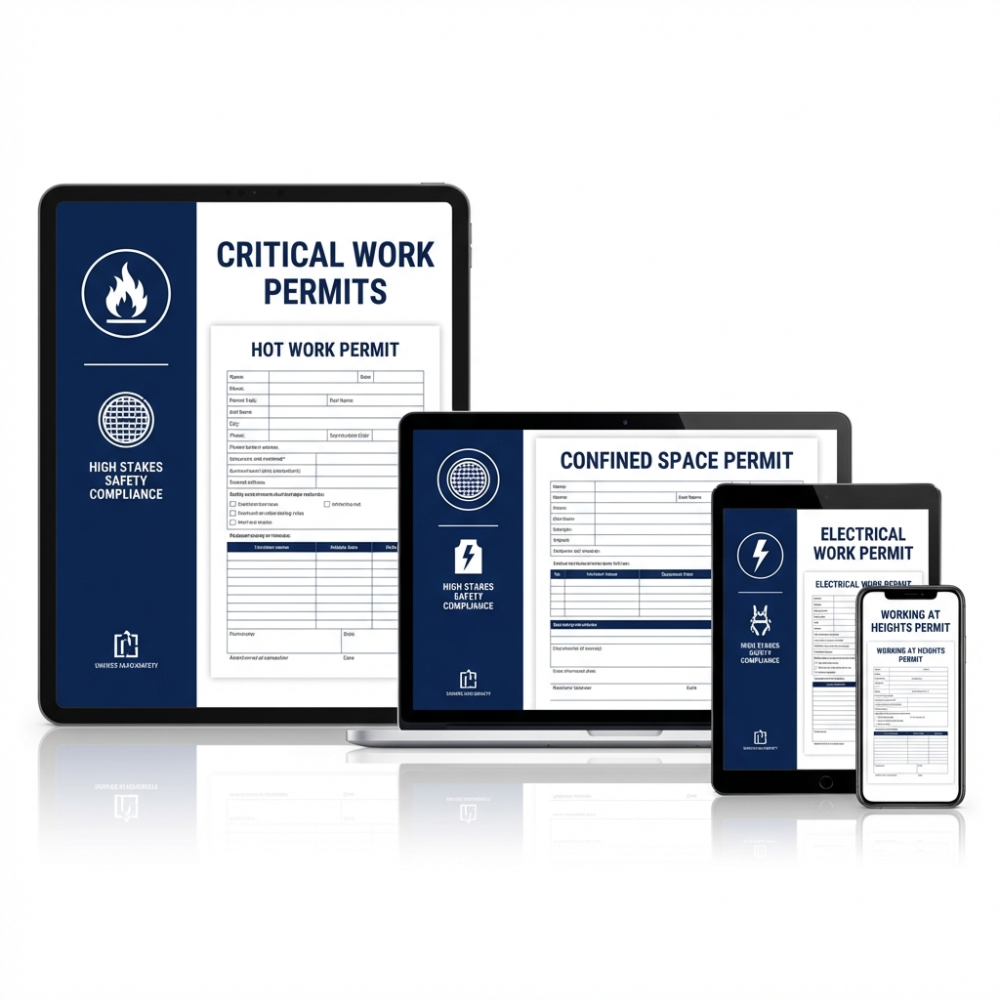

# Critical Work Permits (High Value)

## 🏷️ Price: $147.00
*(One-time purchase. Lifetime updates.)*

---

## ⚠️ High-Stakes Authorization System
Some work is so dangerous that "being careful" isn't enough. You need permission. You need a plan. You need a Permit.
Hot Work. Confined Spaces. High Voltage. Heights. These are the four activities that kill the most skilled tradespeople.

**The Critical Work Permits Kit** provides premium, 2-page authorization documents for these high-risk activities. These aren't generic checklists; they are "Hazard Analysis & Control" tools designed to force your team to pause, think, and enact life-saving controls before a tool is lifted.

---

## 📦 What's Included
1.  **Hot Work Permit (2 Pages)**
    *   *The Fire Stopper.* Includes a "35-Foot Perimeter" checklist and a dedicated Fire Watch Log (Pre/During/Post work).
2.  **Confined Space Entry Permit (2 Pages)**
    *   *The Life Line.* Features a "Kill List" for hazard isolation and a detailed Atmospheric Testing Grid (O2, LEL, H2S, CO). Tracks every entrant in and out.
3.  **Energized Electrical Work Permit (2 Pages)**
    *   *The Last Resort.* Compliant with NFPA 70E. Requires justification for live work, Shock Hazard Analysis, and Arc Flash Boundary calculation.
4.  **Working at Heights Permit (2 Pages)**
    *   *The Fall Catcher.* Mandates the "18.5 Ft Clearance Rule" calculation and requires a documented Rescue Plan before climbing begins.

---

## 🚀 The Problem This Solves
*   **Problem:** Welding fires caused by sparks flying into hidden crevices.
    *   **Solution:** The *Hot Work Permit* forces a 35-ft circle verify and a 60-minute fire watch.
*   **Problem:** Workers entering tanks without testing the air.
    *   **Solution:** The *Confined Space Permit* requires recorded gas readings before entry.
*   **Problem:** Working live just because it's "faster".
    *   **Solution:** The *Electrical Permit* requires management signature to authorize live work.
*   **Problem:** Hanging in a harness with no way down.
    *   **Solution:** The *Heights Permit* demands a rescue plan *before* the fall happens.

---

### "Permission to work is permission to live."
*Instant Digital Download. HTML/PDF Ready.*
